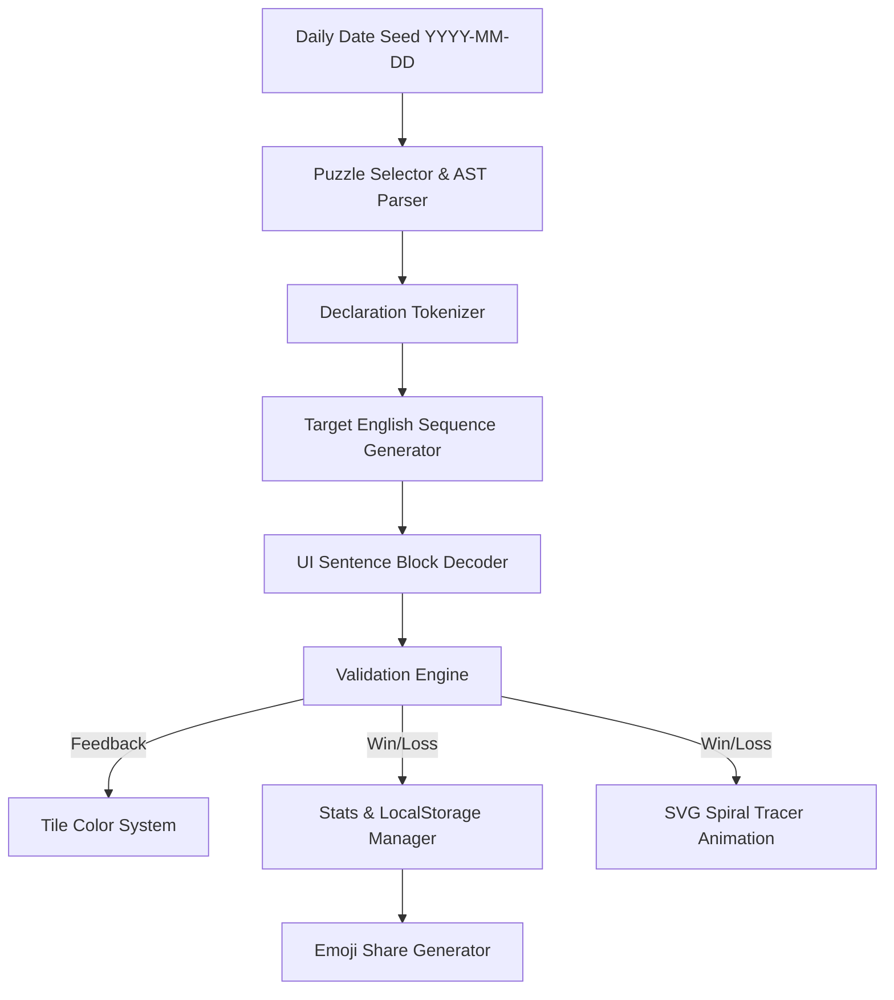

# C-Spiral: Daily C Declaration Web Game
## Feature Specification & Design Document

> **Concept**: A daily web puzzle game based on David Anderson's **Clockwise / Spiral Rule** (1994) for parsing complex C language declarations into plain English.

---

## 1. Executive Summary
`C-Spiral` is a daily micro-game (inspired by Wordle and Connections) targeting developers, computer science students, and programming enthusiasts. Every day, players receive a C declaration (such as `char *(*fp[10])(int);`) and must decode its English translation by applying the Clockwise/Spiral Rule.

---

## 2. Core Game Mechanics

### 2.1 The Clockwise / Spiral Rule Ruleset
The game strictly follows David Anderson's algorithm:
1. **Starting point**: Locate the identifier name (e.g. `fp`, `str`, `signal`).
2. **Clockwise spiral traversal**:
   - `[N]` or `[]` $\rightarrow$ *"array [N] of..."*
   - `(type1, type2)` $\rightarrow$ *"function passing type1, type2 returning..."*
   - `*` $\rightarrow$ *"pointer to..."*
3. **Precedence**: Always resolve inner parentheses `()` first before moving outward.
4. **Base type**: Reach the outermost primitive type (`int`, `char`, `void`, `double`, etc.) and optional qualifiers (`const`, `volatile`).

### 2.2 Primary Gameplay Mode: Sentence Block Decoder
- The game presents a declaration and a shuffled pool of phrase tiles (e.g., `[fp is a]`, `[pointer to]`, `[array 10 of]`, `[function passing int]`, `[returning]`, `[char]`).
- Players select or drag tiles into a target sentence track.
- **Attempts**: Players have up to **4 attempts** per day.
- **Feedback per submission**:
  - 🟩 **Green**: Correct token in correct position.
  - 🟨 **Yellow**: Valid phrase token, but wrong order in the spiral.
  - ⬛ **Gray**: Incorrect phrase segment.

### 2.3 Interactive Spiral Visualizer
- An animated **glowing SVG curve** dynamically traces the clockwise spiral path across the code syntax.
- **Interactive Step-by-Step Mode**: Players can click on code tokens in the correct spiral order to reveal how the sentence is constructed step by step.
- **Solution Reveal**: On completing or forfeiting the puzzle, an interactive diagram shows the full spiral arrows connecting each token in order.

---

## 3. Daily Game Infrastructure & Stats

### 3.1 Deterministic Daily Seed Engine
- Uses a deterministic hash of the UTC date string (`YYYY-MM-DD`) to pick the daily declaration from a curated pool of C declarations.
- Ensures all global players get the exact same challenge each day without requiring a database backend.

### 3.2 Local Storage & State Management
- `localStorage` key `c_spiral_state_v1`:
  - `lastPlayedDate`: `YYYY-MM-DD`
  - `currentGuesses`: Array of guess attempts
  - `isCompleted`: Boolean
  - `isWon`: Boolean
  - `streakCurrent`: Integer
  - `streakMax`: Integer
  - `gamesPlayed`: Integer
  - `guessDistribution`: Object `{ 1: x, 2: y, 3: z, 4: w }`

### 3.3 Emoji Share Generator
Produces spoiler-free share text for clipboard:
```text
C-Spiral #42 🌀 2/4
🟩🟨⬛🟩
🟩🟩🟩🟩
https://c-spiral.dev
```

### 3.4 Midnight Reset Countdown
Displays a live timer counting down to the next UTC midnight reset when tomorrow's puzzle opens.

### 3.5 Rule Guide & Tutorial Modal
An interactive modal explaining the Clockwise/Spiral rule step-by-step with animated code highlights and diagrams for new players.

### 3.6 Archive & Practice Mode
- **Daily Archive**: Play past daily challenges by selecting previous calendar dates.
- **Infinite Practice Mode**: Generates random C declarations (easy, medium, hard) for practice without affecting daily streak stats.

---

## 4. UI / UX Design & Aesthetics

- **Theme**: Dark synthwave / retro terminal aesthetic with neon accents (Cyan `#00f3ff`, Magenta `#ff007f`, Green `#00ff9d`).
- **Typography**: Clean monospace code typography (`Fira Code` / `JetBrains Mono` fallbacks) with highlighted token boundaries.
- **Responsiveness**: Mobile-friendly layout supporting tap-to-select as well as desktop drag-and-drop.
- **Micro-animations**: Smooth tile placement, flip animations for guess validation, and glowing SVG stroke animations for the spiral path.

---

## 5. System Architecture & Tech Stack



- **Frontend Core**: Vanilla HTML5, CSS3 (CSS Variables & Grid/Flexbox), JavaScript (ES Modules).
- **Zero Dependencies**: Lightweight, lightning-fast load, zero build step needed.
- **Hosting Target**: GitHub Pages / Cloudflare Pages / Vercel.

---

## 6. Implementation Roadmap

- [ ] **Phase 1**: Project repository setup & DESIGN.md documentation *(Current)*
- [ ] **Phase 2**: C Declaration Tokenizer & Spiral AST Resolver engine
- [ ] **Phase 3**: Daily Seed Manager & Curated Declaration Bank
- [ ] **Phase 4**: Interactive Frontend UI & Tile Decoder Game Engine
- [ ] **Phase 5**: SVG Clockwise Spiral Animation Layer
- [ ] **Phase 6**: Streaks, LocalStorage, Share Generator & Rules Modal
- [ ] **Phase 7**: Mobile Responsiveness, Polish & Final Verification
